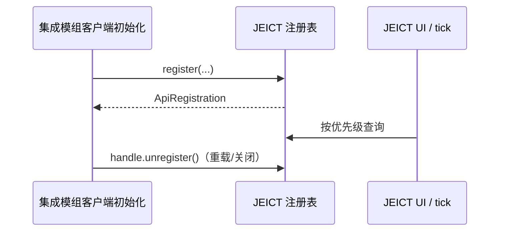

# JEI Crafting Tree Integration API

[中文](#中文) | [English](#english)

## 中文

### 范围与兼容承诺

稳定入口仅为 `com.lhy.jeict.api`。不要引用 `client`、`jei`、`planning` 或 `recipe_tree` 包：它们是实现细节，可在小版本中调整。

API 与 JEICT 主 jar 一同发布，不单独发布 artifact。集成模组应将对应 JEICT jar 作为 `compileOnly` / `compileOnly fg.deobf(...)` 依赖，并在运行环境声明 JEICT 为可选客户端依赖。当前稳定 API 是 **1.0**：同一主版本保持源码和二进制兼容；废弃入口至少保留一个次版本并附迁移说明。

```java
if (!JeiCraftingTreeApi.supportsApiMajor(1)) {
    return;
}
```

### 生命周期与线程

所有 API 都是**客户端限定**。在 NeoForge 的客户端初始化或客户端 setup 后注册；UI、JEI、菜单和自动合成查询必须在客户端主线程调用。注册表自身允许安全读取，但 provider 的 `supports`、`version`、`snapshot` 会在客户端线程执行。



`ApiRegistration.unregister()` 与 `close()` 均可重复调用。保存该句柄，避免开发环境重载或同一集成多次初始化造成遗留注册。

`CraftingTreeApiEvents` 提供客户端主线程事件：`onWorkspaceChanged`（总览打开/关闭）、`onInventoryVersionChanged` 与 `onAutoCraftStatusChanged`。监听器异常会被隔离；回调不得执行阻塞工作或再次触发 UI 状态变更。

### 打开配方树

JEI 回调中可继续使用兼容入口：

```java
JeiCraftingTreeApi.openFromLayout(recipeLayout, returnScreen);
```

`open(...)` / `openFromLayout(...)` 仅适合 JEI 已初始化且客户端屏幕存在时调用。它们不捕获第三方传入对象的错误，调用方应确保使用当前 JEI runtime 的 layout/slots。

### 后端注册

后端为样板检测、编码、上传和机器语义提供能力。活动后端是优先级最高者；同优先级时按 `id` 排序，确保选择可预测。旧的 `CraftingTreeBackends.register(backend)` 仍保留，但只能安装默认兼容后端；新代码使用具名句柄。

```java
ApiRegistration backend = CraftingTreeBackends.register(
        "example:ae_backend", 100, new ExampleBackend());
```

`CraftingTreeBackend` 目前仍包含以 `RecipeTreeRecipeViewModel` 为参数的旧方法，用于维持既有 AE2 Utility 兼容。新增实现应优先使用默认 capability 方法并避免保存这些内部快照；它们仅在调用期间有效。

### 库存来源

`InventorySource` 用于提供玩家背包以外的库存。`snapshot()` 必须返回稳定的快照，数量使用 `long`，并且不得在调用后修改返回列表。`version()` 只在可见库存变化时递增或改变。

```java
ApiRegistration storage = CraftingTreeInventorySources.registerWithHandle(new InventorySource() {
    public String id() { return "example:warehouse"; }
    public int priority() { return 50; }
    public long version() { return warehouseRevision(); }
    public List<InventoryAmount> snapshot() { return immutableWarehouseAmounts(); }
});
```

多个来源若读取同一库存，必须返回相同 `authorityGroup()`。JEICT 只聚合该组中优先级最高且可用的来源，防止同一个网络被重复计算。未覆写时，组名等于 `id()`，保持旧行为。

不要在 `snapshot()` 中发网络包、扫描大型存储或阻塞等待。应在自身缓存更新时提高版本，供 JEICT 低成本读取。

### 打开菜单库存

`MenuInventorySource` 表示**当前打开菜单**中的非玩家库存；它不是远程存储扫描 API。首个 `supports(menu)` 为真的来源独占该菜单，因此网络终端应使用高于通用槽位扫描器的优先级。

```java
ApiRegistration menuSource = CraftingTreeMenuInventorySources.register(new MenuInventorySource() {
    public String id() { return "example:terminal"; }
    public int priority() { return 200; }
    public boolean supports(AbstractContainerMenu menu) { return menu instanceof ExampleTerminalMenu; }
    public long version(AbstractContainerMenu menu, IIngredientManager manager) { return revision(menu); }
    public List<InventoryAmount> snapshot(AbstractContainerMenu menu, IIngredientManager manager) {
        return visibleNetworkStock(menu, manager);
    }
});
```

不要保存 `AbstractContainerMenu` 或 `IIngredientManager` 的引用。它们仅在当前调用有效。内置普通容器和 AE2 菜单来源已注册，第三方来源应只覆盖自己确实识别的菜单。

### 自动合成

`CraftingTreeAutoCrafting.status()` 和 `JeiCraftingTreeApi.autoCraftStatus()` 提供只读状态；`cancel()` 可停止当前任务。自动合成只会通过 JEI transfer handler 填充**当前已打开**的合法合成菜单，然后使用原版容器点击协议取出产物。它不会打开菜单、不会远程搬运，也不允许第三方绕过该限制。

停止原因包括菜单变化、缺少输出、背包空间不足、JEI transfer 失败和同步超时。状态中的配方标题可为 `null`。

### 常见错误

| 情况 | 正确做法 |
| --- | --- |
| 服务端调用或异步线程调用 UI API | 只在客户端主线程调用。 |
| 同一网络被统计两次 | 对同一网络的来源返回相同 `authorityGroup()`。 |
| provider 频繁全量扫描 | 自行缓存，并用 `version()` 表示变化。 |
| 直接引用 `com.lhy.jeict.client` | 改为使用本文列出的 `api` 类型。 |
| 菜单关闭后继续读取 menu | 每次回调即时读取，不保存 menu 引用。 |

## English

### Scope and compatibility

Only `com.lhy.jeict.api` is stable. `client`, `jei`, `planning`, and `recipe_tree` are implementation packages and must not be linked by integrations.

The API ships in the main JEICT jar; there is no separate artifact. Use the matching JEICT jar as a `compileOnly` / `compileOnly fg.deobf(...)` dependency and declare JEICT as an optional client runtime dependency. The current stable API is **1.0**. Source and binary compatibility are preserved within a major version. Deprecated APIs remain for at least one minor release with a migration path.

Use `JeiCraftingTreeApi.supportsApiMajor(1)` before enabling an optional integration.

### Lifecycle and threading

Every API is **client-only**. Register during client initialization or after client setup. UI, JEI, menu, and auto-crafting calls require the client main thread. Provider methods run on that thread. Keep each `ApiRegistration` and call `unregister()` or `close()` on reload/shutdown; both are idempotent.

### Stable entry points

- `JeiCraftingTreeApi` — JEI opening compatibility entry point, API-version and auto-crafting status helpers.
- `CraftingTreeBackends` — deterministic priority registry for one active pattern/encoding backend.
- `CraftingTreeInventorySources` — aggregated inventory snapshots. Use `registerWithHandle` in new integrations.
- `CraftingTreeMenuInventorySources` — one authoritative provider for the currently open menu.
- `CraftingTreeAutoCrafting` — read-only status and cancellation for built-in auto-crafting.
- `CraftingTreeApiEvents` — client-thread workspace, inventory-version, and auto-crafting state listeners.
- `ApiRegistration` — idempotent removable registration handle.

### Minimal backend registration

```java
ApiRegistration registration = CraftingTreeBackends.register(
        "example:backend", 100, new ExampleBackend());
```

The highest priority backend is active. Equal priorities are resolved by id. The legacy `register(CraftingTreeBackend)` stays source-compatible but is intended only for existing integrations.

### Inventory and menu rules

Return detached, immutable inventory snapshots and use `long` quantities. Change `InventorySource.version()` only when visible stock changes. Sources that expose the same physical storage must return the same `authorityGroup()`; only the highest-priority available member is aggregated.

A `MenuInventorySource` is limited to the currently open menu. The first matching source wins, so it replaces generic slot scanning rather than adding to it. Do not retain `AbstractContainerMenu` or `IIngredientManager` after a callback.

### Auto-crafting boundary

Auto-crafting uses JEI transfer into an already open compatible menu and vanilla container clicks to take results. It never opens menus, scans remote storage, or performs arbitrary item movement. `status()` may contain a null recipe title; call `cancel()` to stop a running session.